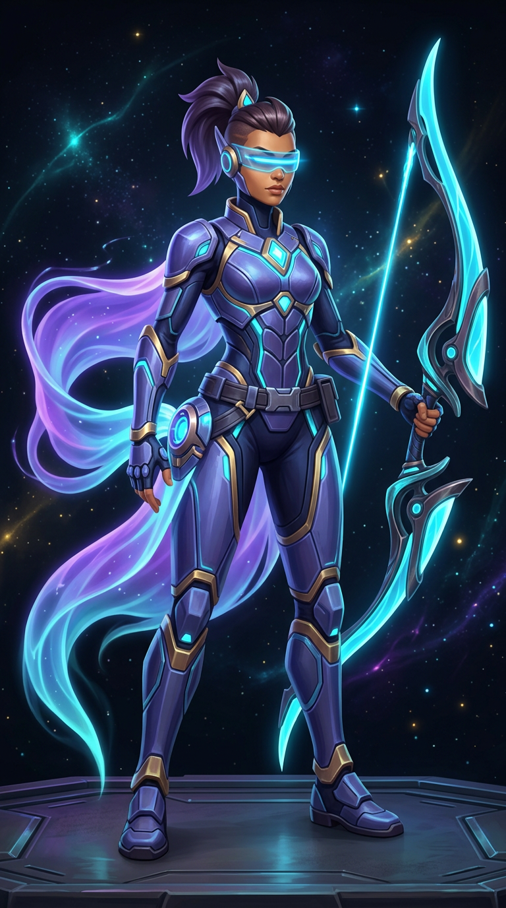

# Lyra Vesper — Hero Foundation (Godot 4.x)

Implementasi **hero playable 3D** untuk contract *Agile Ranged Hunter / Marksman*. Ini bukan satu script karakter monolitik: scene `HeroCharacter` hanya menjadi composition root yang menghubungkan sistem visual, gameplay, control, dan world interaction.

## Hero: Lyra Vesper, *The Lumen Huntress*

Lyra adalah pemburu antarbintang yang membaca lintasan cahaya seperti jejak mangsa. Siluetnya dibuat agar terbaca dari kamera MOBA: **energy bow bercahaya yang besar**, crest/ponytail gelap, mantel aurora asimetris, armor ringan indigo, visor cyan, dan core dada berbentuk berlian. Presentasi 3D native dibangun dari modul mesh Godot yang terikat ke `Skeleton3D`, sehingga proyek ini tetap runnable tanpa ketergantungan model pihak ketiga dan dapat diganti dengan asset skinned production tanpa menyentuh gameplay.



| Slot | Ability | Peran gameplay |
|---|---|---|
| Passive | **Slipstream Ledger** | Bergerak cepat membangun 3 Vantage. Serangan dengan Vantage menandai mangsa; tiga hit bertanda menyiapkan Lumen Arrow yang menembus target dan memberi burst. |
| Q / Skill 01 | **Prism Volley** | Tiga anak panah energi dalam fan sempit untuk burst dan clear yang presisi. |
| E / Skill 02 | **Phase Step** | Dash arah aim 6,8 m dan fase singkat untuk menghindari damage. |
| R / Skill 03 | **Tether Snare** | Proyektil taktis yang melakukan root pada target pertama. |
| F / Ultimate | **Apex Constellation** | Antisipasi/lock-on yang mengirim tiga astral arrow; hit terakhir meledak secara radial dan memberi slow. |

Rincian angka, target, VFX, SFX, dan alasan desain tersedia di [`HERO_DESIGN.md`](heroes/hero_agile_hunter/docs/HERO_DESIGN.md).

## Menjalankan

1. Buka folder ini sebagai project dengan **Godot 4.3+**.
2. Jalankan `demo/scenes/demo_arena.tscn` (atau `F6`), atau tekan `F5` dari project root.
3. Demo membuat Lyra player, satu Lyra dengan controller AI, dan beberapa hostile training drone.

### Kontrol desktop

| Aksi | Input |
|---|---|
| Movement | `W A S D` |
| Basic attack (hold) | `Space` |
| Cycle target | `Tab` |
| Prism Volley | `Q` |
| Phase Step | `E` |
| Tether Snare | `R` |
| Apex Constellation | `F` |

`PlayerInputSource` menyiapkan input desktop saat runtime. `HeroDemoHUD` juga menghubungkan tombol arah, attack, dan skill yang tampil di perangkat mobile ke API input yang sama; gameplay tidak pernah membaca input UI secara langsung.

## Struktur penting

```text
heroes/hero_agile_hunter/
├── scenes/                 # Hero, energy projectile, training target
├── scripts/
│   ├── core/               # stats, health, energy, status, team, DamageEvent
│   ├── gameplay/           # movement, targeting, attack, abilities, damage receiver
│   ├── control/            # CharacterCommand, player, AI, external controller boundary
│   ├── interaction/        # hurtbox, hitbox, detection, projectile
│   ├── presentation/       # procedural rig/model, animation, VFX, audio, camera anchors
│   └── world/              # test target
├── data/                   # authored HeroStats resource
├── audio/                  # small, valid, spatial-ready WAV cue set
└── docs/                   # design, architecture, asset pipeline, validation

demo/                       # external camera, HUD/mobile bridge, smoke-test arena
tests/                      # contract/static validation without an engine binary
```

Lihat [`ARCHITECTURE.md`](heroes/hero_agile_hunter/docs/ARCHITECTURE.md) untuk node tree dan dependency flow, serta [`ASSET_PIPELINE.md`](heroes/hero_agile_hunter/docs/ASSET_PIPELINE.md) untuk hand-off art/audio production dan budget mobile.

## Validasi

```bash
python3 -m unittest discover -s tests -v
# Optional, apabila GDQuest gdtoolkit tersedia:
gdlint heroes demo
```

`tests/test_project_contract.py` memeriksa scene entry point, node contract, asset path, semua ability, uniqueness class, dan validitas WAV. Test ini sengaja tidak memerlukan binary Godot. Untuk runtime QA di editor, ikuti checklist di [`TESTING.md`](heroes/hero_agile_hunter/docs/TESTING.md).

## Status terhadap 3D Hero Production Roadmap V1

Roadmap terbaru menetapkan bahwa primitive/blocky mesh tidak boleh menjadi final character. Karena itu, visual native modular saat ini hanya **prototype teknis** dan tidak diklaim sebagai art final. **Phase 1 — Character Design** sudah terkunci; Phase 2 akan menghasilkan mesh 3D authored sebelum gameplay phase tambahan dapat dinilai sebagai production-ready.

- [`PROJECT_PLAN.md`](PROJECT_PLAN.md) — phase gate, tool decision, dependency order, dan test strategy.
- [`ASSET_PIPELINE.md`](ASSET_PIPELINE.md) — contract concept → authored 3D mesh → UV/PBR → rig → animation → GLB → Godot.
- [`ARCHITECTURE.md`](ARCHITECTURE.md) — runtime boundary yang menjaga visual asset tetap terpisah dari gameplay.
- [`character_design.md`](character_design.md) — design lock Lyra Vesper, color/material language, silhouette, dan Phase 2 handoff.
- [`concept/`](concept/) dan [`references/`](references/) — key concept serta sembilan view reference wajib.

Gameplay bergantung pada interface/komponen (`DamageEvent`, `StatsComponent`, `Hurtbox`, `DamageReceiver`, `TargetingComponent`), **bukan** pada `MeshInstance3D` tertentu. Dengan demikian GLB final dapat menggantikan prototype tanpa membongkar controller, combat, abilities, targeting, atau AI.
